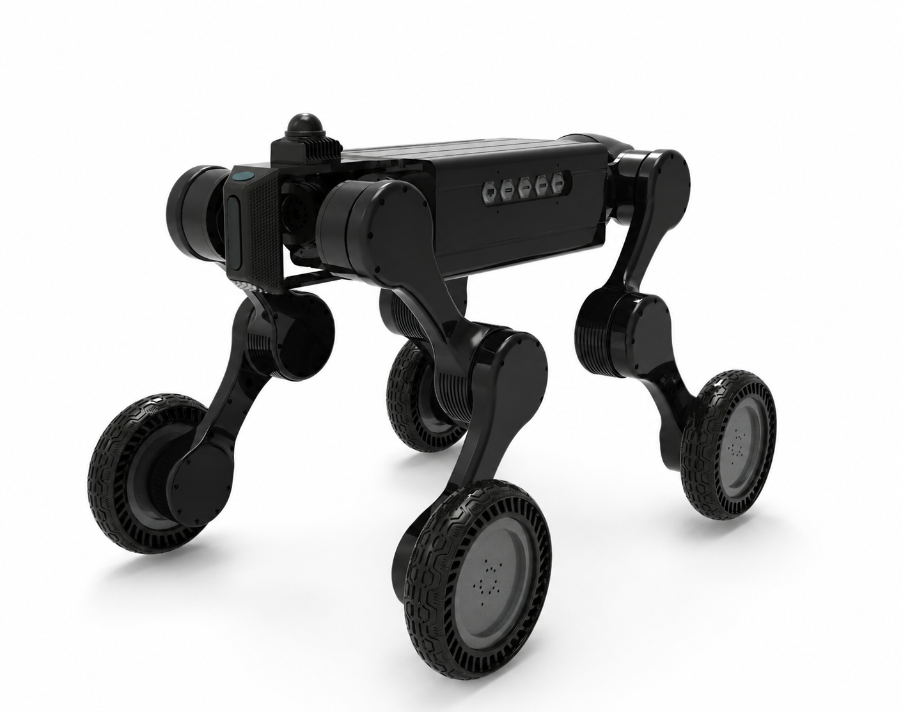
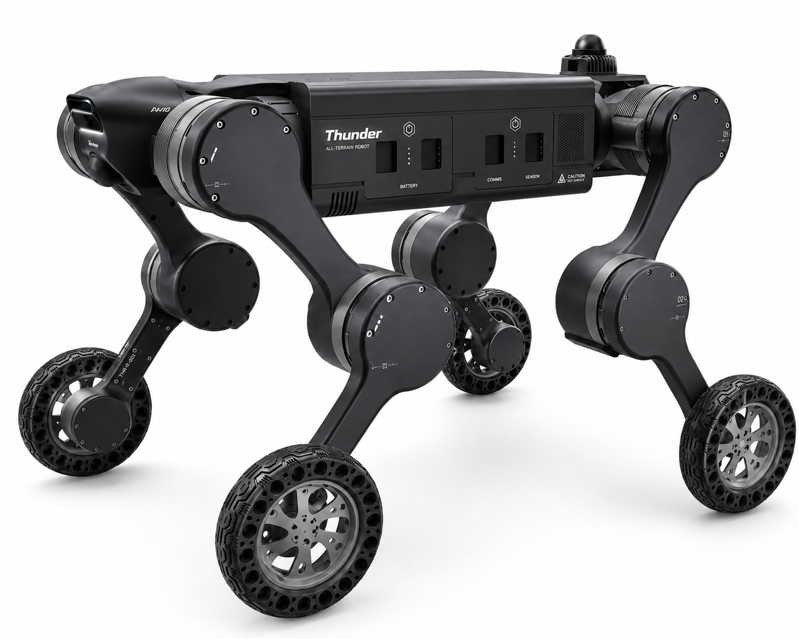

# Thunder Robot Assets

Thunder wheeled-leg robot asset package for CAD review, URDF inspection, and
simulation integration.

This repository keeps two generations of Thunder assets:

- `thunder_v3`: RobotLab / Isaac Lab oriented simulation asset.
- `thunder_v4`: newer 8-inch small-wheel CAD export with updated industrial
  design, wheel assembly, and hidden-harness layout.

## Preview

### Thunder V3



### Thunder V4



## Version Comparison

| Area | Thunder V3 | Thunder V4 |
| --- | --- | --- |
| Main purpose | Stable simulation asset for RobotLab / Isaac Lab | Newer CAD / ROS export for the small-wheel hardware direction |
| Primary URDF | `thunder_v3/urdf/thunder_v3.urdf` | `thunder_v4/urdf/thunder_v4.urdf` |
| Robot model size | 21 links, 20 joints | 21 links, 20 joints |
| Total modeled mass | `48.79163 kg` | `45.8086 kg` |
| Wheel / foot mass | `1.40377 kg` per wheel-foot link | `0.68812 kg` per wheel-foot link |
| Naming style | RobotLab-compatible names such as `FR_hip`, `FL_foot`, `base_link` | SolidWorks export names such as `fr_hip_link`, `fl_foot_Link` |
| Mesh paths | Repository-relative mesh paths under `meshes/` | Repository-relative mesh paths under `meshes/` |
| MuJoCo asset | Includes `mjcf/thunder_v3_mujoco.xml` | Not generated yet |
| Current status | Preferred asset for training / simulation work | Visual and mechanical reference, needs cleanup before training use |

## What Changed in V4

Compared with V3, Thunder V4 updates both the visual design and mechanical
asset export:

- Front perception housing changed from a box-style front sensor block to a
  smoother integrated nose module.
- Side body panels now include Thunder branding, service-door geometry,
  battery / comms / sensor labels, vent details, and caution markings.
- Wheel assembly changed to an 8-inch small-wheel layout with a redesigned rim,
  tire, and hub detail.
- Leg links and actuator covers have more refined surface transitions, screw
  details, and labeling.
- External harness exposure is reduced in the newer layout.
- The wheel-foot motor direction is documented as the RS02 small-wheel variant
  in the V3 changelog archive.

The V4 URDF has been renamed and cleaned for repository use as
`thunder_v4/urdf/thunder_v4.urdf`. It still keeps SolidWorks-style link and
joint names, so target simulators may need a stack-specific naming pass before
training or deployment.

## Repository Layout

```text
thunder_assets/
+-- README.md
+-- img/
|   +-- thunder_v3.png
|   +-- thunder_v4.png
+-- thunder_v3/
|   +-- CHANGELOG.md
|   +-- README.md
|   +-- meshes/
|   +-- mjcf/
|   |   +-- thunder_v3_mujoco.xml
|   +-- urdf/
|   |   +-- thunder_v3.urdf
|   |   +-- legacy/
|   +-- xml/
|       +-- thunder_v3.xml
+-- thunder_v4/
    +-- CMakeLists.txt
    +-- package.xml
    +-- config/
    |   +-- joint_names_thunder_v4.yaml
    +-- launch/
    |   +-- display.launch
    |   +-- gazebo.launch
    +-- meshes/
    +-- textures/
    +-- urdf/
        +-- thunder_v4.csv
        +-- thunder_v4.urdf
```

## Recommended Usage

Use `thunder_v3` when you need a stable simulation package:

- RobotLab / Isaac Lab import
- URDF-based dynamics checks
- MuJoCo rollout experiments using the included MJCF file
- Regression comparison against previous Thunder V3 assets

Use `thunder_v4` when you need the latest CAD reference:

- visual comparison with the updated industrial design
- small-wheel hardware review
- mesh and URDF source material for the next simulation conversion pass
- ROS display / Gazebo smoke tests through the included launch files

## V4 Cleanup Checklist

Before promoting V4 to the primary simulation asset:

- Normalize link and joint names to the simulator convention used by the target
  stack.
- Verify inertial values, collision geometry, wheel axes, and joint limits.
- Generate and validate a MuJoCo MJCF file if MuJoCo / Isaac Lab workflows need
  it.
- Run an import smoke test in the target simulator before training policies.

## Current Validation Notes

The following basic checks have been performed on the current files:

- `thunder_v3/urdf/thunder_v3.urdf`: 21 links, 20 joints, total modeled mass
  `48.79163 kg`.
- `thunder_v4/urdf/thunder_v4.urdf`: 21 links, 20 joints, total
  modeled mass `45.8086 kg`.
- Preview images exist for both V3 and V4 under `img/`.

Not yet validated:

- Thunder V4 import in ROS / RobotLab / Isaac Lab.
- Thunder V4 MuJoCo conversion.
- Policy rollout or sim-to-real behavior with the V4 asset.

## License

License and redistribution terms are not defined in this folder yet. Add a
`LICENSE` file before publishing the project publicly.
