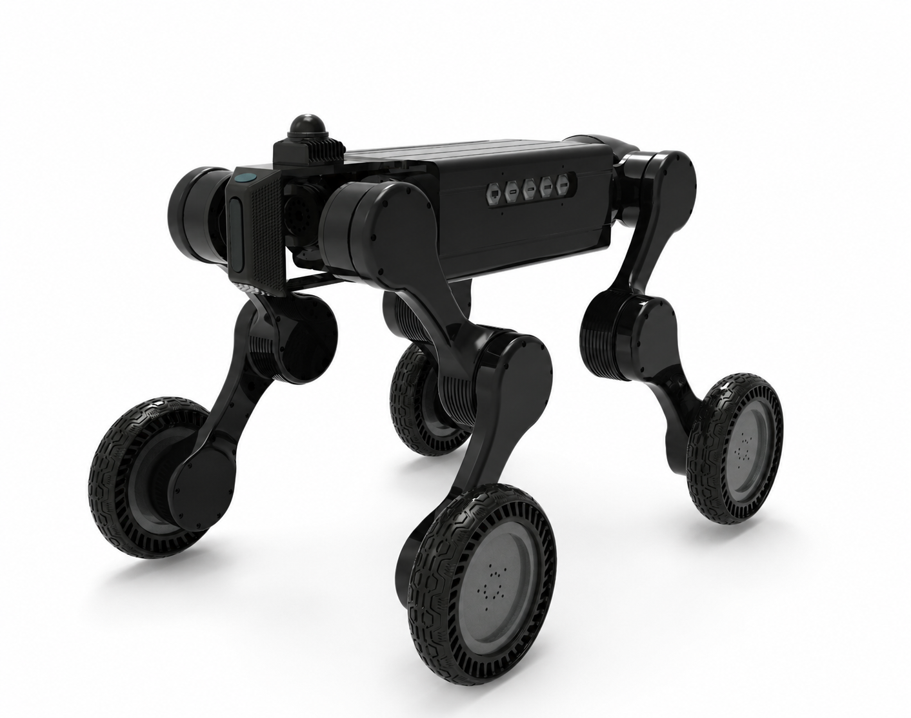
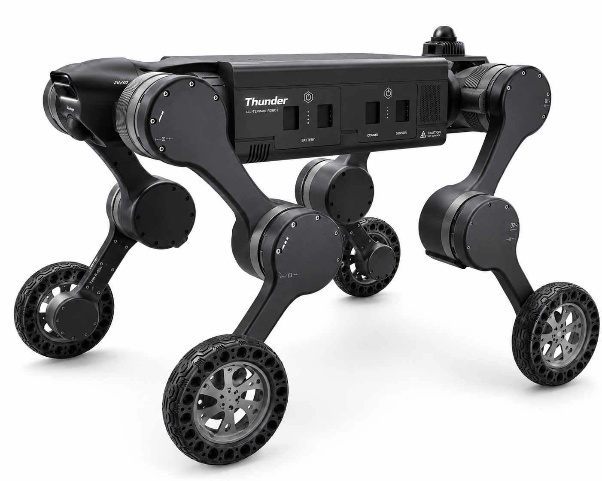

# Thunder Robot Assets

Thunder wheeled-leg robot asset package for CAD review, URDF inspection, and
simulation integration.

**Thunder V4 is the current robot version.** This repository keeps V3 for
historical policy compatibility and regression comparisons.

- `thunder_v4`: current small-wheel robot, with canonical URDF, CAD meshes,
  and a loadable MuJoCo model. See the [V4 definition](thunder_v4/README.md).
- `thunder_v3`: previous-generation RobotLab / Isaac Lab and MuJoCo assets.

## Preview

### Thunder V3



### Thunder V4



## Version Comparison

| Area | Thunder V3 | Thunder V4 |
| --- | --- | --- |
| Main purpose | Previous-generation simulation and policy compatibility | Current small-wheel robot and simulation asset |
| Primary URDF | `thunder_v3/urdf/thunder_v3.urdf` | `thunder_v4/urdf/thunder_v4.urdf` |
| Robot model size | 21 links, 20 joints | 21 links, 20 joints |
| Total modeled mass | `48.79163 kg` | `45.8086 kg` |
| Wheel / foot mass | `1.40377 kg` per wheel-foot link | `0.68812 kg` per wheel-foot link |
| Naming style | RobotLab-compatible names such as `FR_hip`, `FL_foot`, `base_link` | SolidWorks export names such as `fr_hip_link`, `fl_foot_Link` |
| Mesh paths | Repository-relative mesh paths under `meshes/` | Repository-relative mesh paths under `meshes/` |
| MuJoCo asset | `thunder_v3/mjcf/thunder_v3_mujoco.xml` | `thunder_v4/mjcf/thunder_v4_mujoco.xml` |
| Current status | Legacy comparison asset | Current V4 definition; MuJoCo import and contact contract checked |

## What Changed in V4

Compared with V3, Thunder V4 updates both the visual design and mechanical
asset export:

- Front perception housing changed from a box-style front sensor block to a
  smoother integrated nose module.
- Side body panels now include Thunder branding, service-door geometry,
  battery / comms / sensor labels, vent details, and caution markings.
- Wheel assembly changed to an 8-inch small-wheel layout with a redesigned rim,
  tire, and hub detail.
- Leg links and actuator covers have more refined surface transitions, screw
  details, and labeling.
- External harness exposure is reduced in the newer layout.
- The wheel-foot motor direction is documented as the RS02 small-wheel variant
  in the V3 changelog archive.

The V4 URDF has been renamed and cleaned for repository use as
`thunder_v4/urdf/thunder_v4.urdf`. It still keeps SolidWorks-style link and
joint names. The supplied V4 MJCF uses RobotLab-compatible names such as
`FR_hip_joint`, while preserving V4 geometry, mass, axes, and limits.

The V4 wheel-foot joints use separate RS02 motor limits instead of the larger
leg-actuator placeholder limits: `effort=17` and `velocity=44` on the four
continuous foot joints. These values are based on the RobStride RS02 manual's
maximum torque and speed feedback ranges:
https://www.robstride.com/assets/product_manual_robStride02-e7f9f7c4.pdf.

## Contact Materials

| Asset | Contact friction source |
| --- | --- |
| Current V4 MuJoCo MJCF | Scoped wheel and supplied-ground friction `1.0 0.005 0.0001`, `condim=4` |
| V3 MuJoCo MJCF | Explicit geom friction `1.0 0.005 0.0001` |
| V3 and V4 URDF | No contact material declared; configure the target simulator |

For MuJoCo, the three values mean sliding friction `1.0` (dimensionless),
torsional friction `0.005 m`, and rolling friction `0.0001 m`. The V3 MJCF
retains its existing contact dimensions: wheel contacts use `condim=3`, so
torsional and rolling friction are not active. This explicit declaration
preserves the asset's previously compiled friction values.
The material class is scoped to the V3 robot subtree and supplied ground,
leaving other world geometry's material settings under the world's control.

The V4 definition is consumed directly by
[`thunder_v4_mujoco.xml`](thunder_v4/mjcf/thunder_v4_mujoco.xml). Its four wheel
collisions inherit `thunder_v4_rubber_wheel`, and its supplied ground uses the
scoped `thunder_v4` class. With `condim=4`, sliding and torsional friction are
active; rolling friction is declared but inactive. An external world retains
its own material settings. Check actual combined wheel/ground contacts when
changing worlds, since a ground geom can raise the combined friction.

The V4 URDF is not a MuJoCo material file. Isaac Lab training configures its
physics materials in the environment, and Gazebo uses its own material
configuration. Do not copy MuJoCo's torsional/rolling values into another
simulator without checking its parameter meanings and units. These values are
a simulation configuration, not measured tire/ground calibration.

See MuJoCo's [geom friction reference](https://mujoco.readthedocs.io/en/stable/XMLreference.html#body-geom-friction)
and [contact parameter combination](https://mujoco.readthedocs.io/en/stable/modeling.html#contact-parameters),
and the downstream [LingTu correction](https://github.com/Kitjesen/MapPilot/pull/22).

## Repository Layout

```text
thunder_assets/
+-- README.md
+-- img/
|   +-- thunder_v3.png
|   +-- thunder_v4.png
+-- thunder_v3/
|   +-- CHANGELOG.md
|   +-- README.md
|   +-- meshes/
|   +-- mjcf/
|   |   +-- thunder_v3_mujoco.xml
|   +-- urdf/
|   |   +-- thunder_v3.urdf
|   |   +-- legacy/
|   +-- xml/
|       +-- thunder_v3.xml
+-- thunder_v4/
    +-- README.md
    +-- CMakeLists.txt
    +-- package.xml
    +-- config/
    |   +-- joint_names_thunder_v4.yaml
    +-- launch/
    |   +-- display.launch
    |   +-- gazebo.launch
    +-- meshes/
    +-- mjcf/
    |   +-- thunder_v4_mujoco.xml
    +-- textures/
    +-- urdf/
        +-- thunder_v4.csv
        +-- thunder_v4.urdf
```

## Recommended Usage

Use `thunder_v4` for current robot work:

- visual comparison with the updated industrial design
- small-wheel hardware review
- URDF integration and MuJoCo simulation using the supplied V4 MJCF
- ROS display / Gazebo smoke tests through the included launch files

Use `thunder_v3` when reproducing a V3-trained policy or comparing against
previous-generation assets. Selecting V4 does not automatically make an old
policy compatible with its geometry or controller contract.

## V4 Integration

V4 is the current asset version. For each controller integration:

- Match the policy's observation/action order, gains, timing, and training asset.
- Keep the current URDF's `0.095 m` wheel radius distinct from the `0.093 m`
  radius in LingTu's previously qualified policy asset.
- Run a rollout for the selected policy and simulator before claiming motion
  performance. The asset does not embed a locomotion controller.

## Current Validation Notes

The following basic checks have been performed on the current files:

- `thunder_v3/urdf/thunder_v3.urdf`: 21 links, 20 joints, total modeled mass
  `48.79163 kg`.
- `thunder_v4/urdf/thunder_v4.urdf`: 21 links, 20 joints, total
  modeled mass `45.8086 kg`.
- Thunder V4 hip / thigh / calf limits are nonzero, and the four wheel-foot
  continuous joints use RS02-specific effort / velocity limits.
- Thunder V4 inertia matrices are positive definite and pass principal-moment
  physicality checks.
- Thunder V4 movable joint axes match the established Thunder V3 URDF
  direction convention; the CSV metadata is normalized to the same axis signs.
- Preview images exist for both V3 and V4 under `img/`.
- The V4 MJCF compiles in MuJoCo 3.10.0 with a free base, 16 actuators, and
  total modeled mass `45.8086 kg`; wheel geometry and joint limits match the URDF.
- All four V4 wheel/ground contacts use `condim=4` and torsional friction
  `0.005 m`. Scoped V4 defaults preserve an external world's material.

Not yet validated:

- Thunder V4 import in ROS / RobotLab / Isaac Lab.
- Policy rollout with this repository's `0.095 m` V4 MJCF, or its sim-to-real
  behavior. LingTu's `0.093 m` rollout results do not qualify this geometry.

## License

License and redistribution terms are not defined in this folder yet. Add a
`LICENSE` file before publishing the project publicly.
